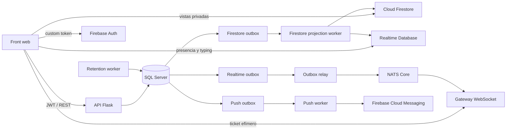

# Arquitectura del stack backend

Libros API es un backend Flask con SQL Server como fuente de verdad. NATS, WebSocket, Firestore, Realtime Database y FCM aceleran la experiencia, pero no sustituyen los datos recuperables por REST y SQL.

## Componentes

| Componente | Responsabilidad | Entrada | Salida |
|---|---|---|---|
| API Flask | Auth, dominio, permisos, REST, reset QA | HTTP | SQL y outboxes transaccionales |
| SQL Server | Estado autoritativo y auditable | consultas/transacciones | REST, workers y snapshots QA |
| NATS Core | Señal efímera de novedades | relay | gateway; sin replay |
| Gateway WebSocket | Entrega eventos por usuario | tickets cortos y NATS | sockets del front |
| Outbox relay | Publica eventos confirmados | `realtime_outbox_eventos` | NATS |
| Projection worker | Reconstruye vistas privadas | `firestore_outbox_proyecciones` y SQL | Firestore y membresías RTDB |
| Push worker | Entrega notificaciones push | `push_outbox_eventos` | FCM y revocación de tokens inválidos |
| Retention worker | Purga controlada y heartbeat | tablas operativas | SQL limpio según retención |
| Firebase Auth | Traduce identidad Libros a UID Firebase | custom token `libros:<id>` | sesión Firebase del cliente |
| Firestore | Proyecciones privadas con listeners | worker | lecturas owner-only |
| RTDB | Presencia y typing efímeros | cliente y worker | estado realtime limitado |

## Autoridad y recuperación

- SQL y REST son autoritativos.
- Firestore contiene proyecciones reconstruibles; el cliente no escribe en ellas.
- RTDB solo contiene estado efímero y membresías privadas de apoyo.
- NATS no conserva historial. Duplicados, desorden o pérdida se resuelven deduplicando por `eventId` y recargando REST/Firestore.
- Un fallo de Firebase o NATS no revierte la transacción de negocio que ya confirmó su outbox.

## Entornos

| Entorno | Base SQL | Firebase | NATS/WS | Reset QA |
|---|---|---|---|---|
| `local` | desarrollo, normalmente `libros_pruebas` | emuladores o config local | procesos locales | no existe |
| `qa` | nombre obligatorio terminado en `_qa` | proyecto exclusivo `libros-qa` o emuladores QA | puertos/prefijo propios | disponible con cuatro guards |
| `produccion` | producción | proyecto de producción | recursos de producción | ruta no registrada |

Los orígenes CORS se enumeran exactamente en `LIBROS_CORS_ALLOWED_ORIGINS`; no se aceptan comodines ni rutas. `/runtime-config` solo publica datos web de Firebase, WebSocket y entorno. Las credenciales administrativas, JWT, tickets y tokens de reset nunca se exponen.

QA publica API y WebSocket mediante el túnel Cloudflare exclusivo `libros-qa`; sus orígenes siguen ligados a loopback. SQL Server, NATS y su monitor no se exponen a Internet.

## Arranque

- Stack normal: `scripts/start-realtime-stack.ps1`.
- QA nativo: `qa/setup.ps1`, `qa/start.ps1`, `qa/status.ps1`, `qa/stop.ps1`.
- Smoke QA: `scripts/qa-smoke.ps1`.

La operación detallada está en `api/OPERACION.md`, `realtime/OPERACION.md` y `qa/README.md`.
